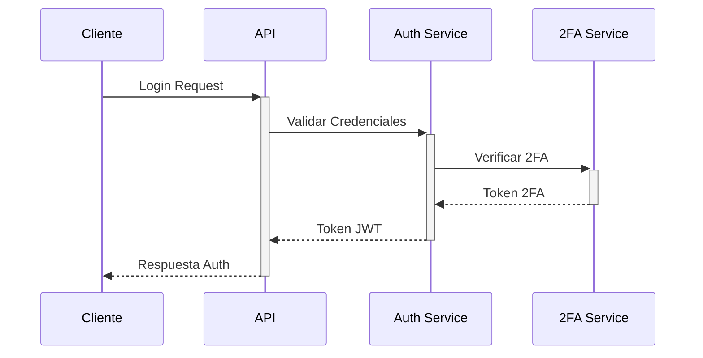
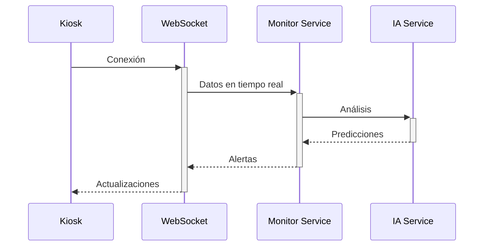

# Documentación de Arquitectura - Admin Kiosk
Este código solo puede ser modificado según @cura.md y project_custom_structure.txt

## 1. Visión General del Sistema

### 1.1 Propósito
El sistema Admin Kiosk proporciona una plataforma centralizada para la gestión y monitoreo de kiosks, integrando capacidades de IA para la detección de anomalías y optimización de operaciones.

### 1.2 Arquitectura General
- **Patrón MVT (Model-View-Template)**
- **Servicios Independientes**
- **API RESTful**
- **WebSockets para Monitoreo en Tiempo Real**

## 2. Componentes Principales

### 2.1 Backend (Django + Django REST Framework)
- **Models**: Definición de datos y lógica de negocio
- **Views**: Controladores de la lógica de presentación
- **Services**: Lógica de negocio compleja y operaciones
- **Tasks**: Procesos asíncronos y trabajos programados

### 2.2 Frontend (React + TypeScript)
- **Componentes**: UI modular y reutilizable
- **Hooks**: Gestión de estado y efectos
- **Services**: Comunicación con API
- **WebSocket**: Conexiones en tiempo real

### 2.3 Sistema de IA
- **Módulo de Predicción**: Detección de anomalías
- **Módulo de Entrenamiento**: Actualización de modelos
- **Sistema de Explicabilidad**: Interpretación de predicciones
- **Monitoreo de Drift**: Detección de cambios en datos

## 3. Flujos de Datos

### 3.1 Autenticación y Autorización

### 3.2 Monitoreo de Kiosks

## 4. Seguridad

### 4.1 Capas de Seguridad
- Autenticación de dos factores (2FA)
- JWT con rotación de tokens
- Rate limiting
- Validación de entrada
- CORS configurado
- Headers de seguridad

### 4.2 Protección de Datos
- Encriptación en tránsito (TLS)
- Encriptación en reposo
- Sanitización de entrada
- Auditoría de accesos

## 5. Escalabilidad y Rendimiento

### 5.1 Estrategias de Caché
- Redis para caché distribuido
- Caché de consultas frecuentes
- Caché de sesiones

### 5.2 Optimizaciones
- Índices de base de datos
- Consultas optimizadas
- Compresión de respuestas
- Lazy loading

## 6. Monitoreo y Logging

### 6.1 Métricas Clave
- Tiempo de respuesta
- Uso de recursos
- Errores y excepciones
- Métricas de negocio

### 6.2 Sistema de Logs
- Logs estructurados
- Niveles de severidad
- Rotación de logs
- Agregación centralizada

## 7. Despliegue

### 7.1 Infraestructura
- Contenedores Docker
- Orquestación con ECS
- Base de datos PostgreSQL
- Redis para caché y colas

### 7.2 CI/CD
- GitHub Actions
- Tests automatizados
- Despliegue continuo
- Monitoreo de salud 